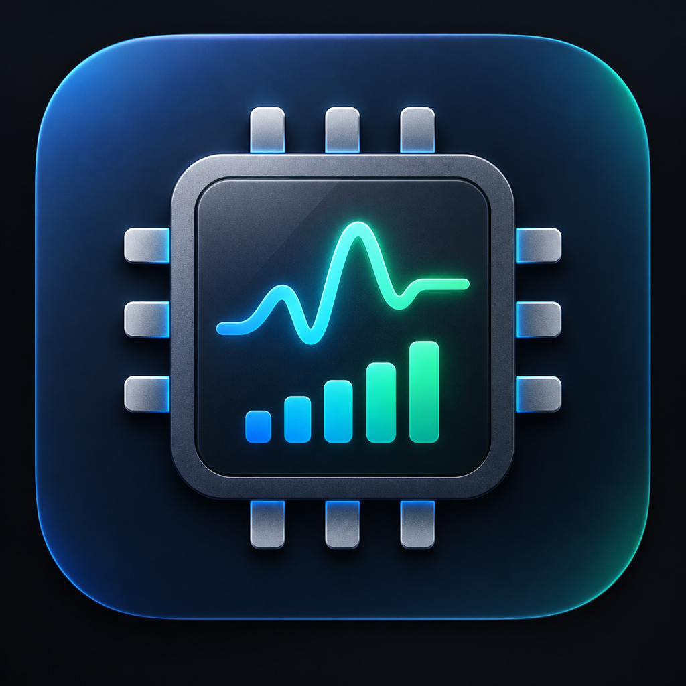
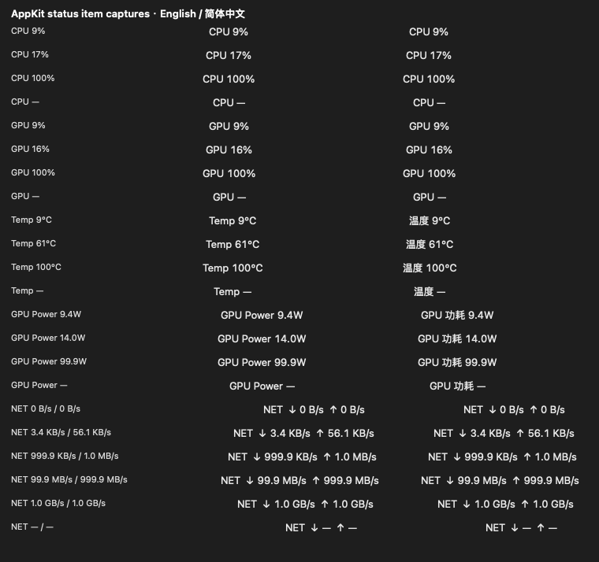

[English](README.md) | 简体中文

<p align="center">
  
</p>

<h1 align="center">SiliconMeter</h1>

<p align="center"><strong>给 Mac 一份性能记忆。</strong></p>

<p align="center">
面向 Apple Silicon Mac 的轻量、本地优先菜单栏性能监控与 SQLite 历史记录工具，让人、脚本、本地 AI 模型和 Agent 都能读取真实的系统性能历史。
</p>

<p align="center">
  <a href="https://github.com/Trojon99/SiliconMeter/releases"></a>
  
  
  <a href="LICENSE"></a>
  
</p>

SiliconMeter 是一款轻量的 **Apple Silicon 性能监控器**、**macOS 菜单栏系统监控工具**和**本地遥测记录器**。它持续记录 CPU、GPU、温度、估算 GPU 功耗、网络、内存压力、交换空间和系统热状态，并将历史保存在本地 SQLite 数据库中。

它的目标不只是告诉你“Mac 现在用了多少性能”，而是让这台 Mac 拥有一份可以回看的**性能记忆**。

> **可以把它理解成“Mac 的 Garmin”。** Garmin 持续记录人的身体状态和运动表现；SiliconMeter 则持续记录 Mac 的计算状态和性能表现。

用户、脚本、本地 LLM、AI Agent 或自动化工具都可以读取这些历史数据，分析硬件资源如何被使用，并用于优化外部工作负载，例如 **MLX / 本地大模型训练与推理、llama.cpp / Ollama 类本地推理、编译、渲染和长期计算任务**。SiliconMeter 本身**不运行 AI、不识别单个进程，也不会自动调参或优化工作负载**。

**0.1.0** 已在 [GitHub Releases](https://github.com/Trojon99/SiliconMeter/releases) 发布。

## 为什么做 SiliconMeter？

大多数系统监控工具主要回答：

> **“现在发生了什么？”**

SiliconMeter 还会把时间轴留下来：

```text
Apple Silicon
     ↓
SiliconMeter
     ├── 菜单栏 / 实时遥测
     └── 本地 SQLite 历史
                     ↓
            人 / 脚本 / AI Agent
```

因此，你可以比较某个工作负载运行前、运行中和运行后的系统状态，而不是只看某一刻的百分比。

典型的外部应用场景包括：

- 检查长时间本地 AI 工作负载运行时 GPU 是否持续活跃；
- 对比不同运行方案下的 P-Core / E-Core 使用情况；
- 将 GPU 活跃率与温度、估算 GPU 功耗联系起来分析；
- 发现内存压力、Swap 活动或 Thermal State 变化；
- 回看模型下载、数据读取、远程任务期间的网络吞吐；
- 将结构化性能历史交给本地 AI / Agent，作为后续分析和优化的上下文。

## 菜单栏

SiliconMeter 一次显示一项主指标：

```text
CPU 23%
GPU 91%
温度 61°C
GPU 功耗 14.0W
NET ↑ 1.3 MB/s ↓ 12.4 MB/s
```

每项指标和语言都有稳定的状态栏宽度，正常读数变化不会推动旁边的菜单栏项目。

<p align="center">
  
</p>

## 监控内容

| 类别 | 遥测内容 |
|---|---|
| CPU | CPU 总占用，以及经过验证的 P-Core / E-Core 活跃率 |
| GPU | GPU 活跃驻留比例、估算的活跃加权频率 |
| 功耗 | 估算 GPU 功耗 |
| 温度 | AppleSMC Tp05 CPU 传感器、Tg05 GPU 传感器 |
| 内存 | VM / 统一内存字段、Swap、内存压力 |
| 热状态 | macOS Thermal State 及状态变化 |
| 网络 | 当前选定外部网络接口的汇总上传/下载速率 |
| 历史 | 带质量状态的本地 SQLite 结构化时间序列 |

不可用或无效的指标会保持明确的不可用状态，不会被伪装成 0。估算指标会在弹出窗口和历史数据中标记为 estimate/estimated。

## 为 AI 准备的历史，而不是内置 AI

SiliconMeter 有意把**测量**和**解释**分开。

它内部没有 LLM，也不会自己判断某次任务“跑得好不好”。它只负责保存结构化、可机器读取的性能历史，让其他工具按需查询。

实时数据库位于：

```text
~/Library/Application Support/SiliconMeter/telemetry.sqlite3
```

例如，本地脚本或 AI Agent 可以直接查询最近 10 分钟真实测得的 GPU 活跃率：

```sql
SELECT datetime(utc_ms/1000, 'unixepoch') AS utc,
       gpu_active*100 AS gpu_percent,
       gpu_active_window_s
FROM fast_samples
WHERE utc_ms >= (unixepoch('now') - 600)*1000
  AND gpu_active_quality = 'measured'
ORDER BY utc_ms;
```

完整字段、单位和查询示例见 [SQLite 历史表结构](docs/HISTORY_SCHEMA.md)。

一种典型使用方式可以是：

```text
本地工作负载
      ↓
SiliconMeter 记录系统遥测
      ↓
SQLite 历史
      ↓
本地 LLM / AI Agent / 分析脚本
      ↓
比较不同运行方案、发现闲置资源、提出外部任务调整建议
```

在这个流程中，SiliconMeter 始终只是一个通用的监控器和记录器。

## 功能

- 原生 Apple Silicon macOS 菜单栏 App。
- 五项可选实时主指标：CPU、GPU、温度、GPU 功耗、NET。
- 简洁弹出窗口展示 CPU、GPU、内存、热状态、网络和历史记录状态。
- UI 与日志共用同一份中心遥测快照，不重复采集。
- 快速样本约每 2 秒记录，慢速样本约每 6 秒记录。
- SQLite WAL + 串行批量写入，并保留 measured / estimated / unavailable / invalid / stale 等质量语义。
- 历史记录保留时间可选：**1 天、7 天、30 天、永久**。
- 支持 English / 简体中文，并本地保存语言和主指标选择。
- 无需 root，无常驻监控子进程，不依赖 `powermetrics`，没有分析服务、云服务或遥测上传。
- MIT License，源码公开。

## 历史记录保留时间

可选择 **1 天**（滚动 24 小时）、**7 天**、**30 天**或**永久**。

- 全新安装默认 **30 天**。
- 已有数据库若尚无保留时间设置，则默认**永久**，避免静默删除旧数据。
- 缩短保留时间需要确认。
- 清理在后台执行，不会自动运行 `VACUUM`。
- 删除记录后 SQLite 文件大小不一定立刻缩小，因为释放的页面会被后续数据复用。

在加入保留策略之前，最终候选 30 分钟测试中的 SQLite 逻辑增长约为 **0.688 MB/小时**，按这一短期速率约为 **16.5 MB/天**、**495 MB/30 天**。这些只是估算，不是存储上限；运行时 WAL / SHM 还会增加临时磁盘占用。

## 隐私

SiliconMeter 坚持**本地优先**：

- 所有遥测和历史数据只保存在这台 Mac；
- 无 analytics，无遥测上传；
- 无云服务；
- 不读取用户文件内容；
- 不做进程归属；
- Network 仅读取系统接口计数器，不主动测速、不产生监控流量；
- 语言、主指标和保留时间保存在本地 `UserDefaults`。

数据库保存的是通用系统遥测，不记录模型 Prompt、工作负载名称等业务内容。

## 安装

SiliconMeter v0.1.0 当前以**未签名、未公证的开源社区构建**形式发布，未经 Apple 验证。

1. 从 [GitHub Releases](https://github.com/Trojon99/SiliconMeter/releases) 下载 `SiliconMeter-0.1.0-arm64.dmg`。
2. 打开 DMG，将 **SiliconMeter.app** 拖入**应用程序**文件夹。
3. 从“应用程序”启动 SiliconMeter。
4. 如果 macOS 阻止首次启动，打开**系统设置 → 隐私与安全性 → 仍要打开**，然后再次确认打开。

浏览器下载后的 Gatekeeper 流程已经在测试机器上手动验证。不要全局关闭 Gatekeeper。

## 系统要求

- Apple Silicon Mac（arm64）
- macOS 13 或更新版本
- 无需 root 权限

**已测试：** Apple M1 Max、macOS 27.0（build 26A428）。

其他 Apple Silicon 芯片和 macOS 版本属于尽力兼容。IOReport 和 AppleSMC 是私有/未公开接口，未来系统版本可能改变其行为。

## 从源码构建

安装包含 Swift 和 Clang 的 Apple Command Line Tools，然后运行：

```sh
sh app/build.sh
open app/SiliconMeter.app
```

App 以辅助应用形式运行，不显示 Dock 图标。未签名的 v0.1 不包含“登录时启动”。

定向测试见 [tests/README.md](tests/README.md)；[产品范围](docs/PRODUCT_SCOPE.md)定义了 v0.1 的边界。

## 数据访问

数据库：

```text
~/Library/Application Support/SiliconMeter/telemetry.sqlite3
```

App 使用 SQLite WAL，因此运行时可能存在 `-wal` 和 `-shm` 文件。实时备份应使用 SQLite backup API。外部只读程序可以在 SiliconMeter 持续记录时查询已提交历史。

参见 [HISTORY_SCHEMA.md](docs/HISTORY_SCHEMA.md)，了解 schema v4、单位、质量状态、保留策略以及可直接运行的 SQL 示例。

## 升级说明

早期本地开发版本使用 `Compute Monitor` 数据目录。首次启动时，仅当新的 SiliconMeter 目录不存在时，App 才会迁移旧目录；若两个目录都已经存在，则会保留两者并使用 SiliconMeter 目录。

## 已知限制

- IOReport 和 AppleSMC 属于私有/未公开接口，可能随硬件或 macOS 更新而失效。
- GPU 功耗和 GPU 活跃加权频率是估算值，尚未经过外部绝对校准。
- 网络接口选择采取保守策略，部分特殊物理接口可能不会被计入。
- VPN 隧道计数不单独累加，以避免与底层链路重复计数。
- App 内没有历史图表、进程归属、工作负载分析或自动调优。
- v0.1.0 社区构建未签名、未公证。

这些限制是有意的：SiliconMeter 负责**测量和记忆**，解释和决策留给外部工具。

## 许可证

本项目采用 MIT License，详见 [LICENSE](LICENSE)。
